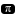

# FILLED - RECTANGLE
### src

`source`
`sources`
`src`
`project`
`projects`
`app`
`apps`
`code`
### devcontainer

`.devcontainer`
`devcontainer`
### github

`github`
`.github`
`workflow`
`workflows`
### husky

`husky`
`.husky`
### git

`git`
`.git`
`patches`
`githooks`
`.githooks`
`submodules`
`.submodules`
### idea

`.idea`
`idea`
### angular

`.angular`
`angular`
### vscode

`vscode`
`.vscode`
### nx

`nx`
`.nx`
### hole

`node_modules`
### component

`component`
`components`
### typescript

`type`
`types`
`model`
`models`
`interface`
`interfaces`
`typings`
`@types`
### util

`utils`
`util`
`utility`
`utilities`
### constant

`constant`
`constants`
### test

`test`
`tests`
`e2e`
`integration`
`integrations`
`coverage`
`.nvc-output`
`it`
`integration-test`
`integration-tests`
`__integration-test__`
`__integration-tests__`
`testing`
`__tests__`
`__test__`
`spec`
`specs`
### style

`style`
`styles`
### android

`android`
### ios

`ios`
### assets

`asset`
`assets`
`public`
`image`
`images`
`_images`
`_image`
`_imgs`
`_img`
`imgs`
`img`
`icons`
`icon`
`ico`
`figures`
`figure`
`figs`
`fig`
`screenshot`
`screenshots`
`screengrab`
`screengrabs`
`pic`
`pics`
`picture`
`pictures`
`photo`
`photos`
`photograph`
`photographs`
### cypress

`cypress`
`.cypress`
### playwright

`playwright`
### locale

`i18n`
`internationalization`
`lang`
`langs`
`language`
`languages`
`locale`
`locales`
`i10n`
`localization`
`translation`
`translate`
`translations`
`.tx`
### draft

`_draft`
`_drafts`
`fixture`
`fixtures`
`mocks`
`mock`
`concept`
`concepts`
`sketch`
`sketches`
### dist

`dist`
`out`
`build`
`release`
`.output`
`bin`
### view

`view`
`views`
`screen`
`screens`
`page`
`pages`
`public_html`
`html`
### convex

`convex`
### audio

`aud`
`auds`
`audio`
`audios`
`music`
`sound`
`sounds`
### aws

`aws`
`.aws`
### azure

`.azure-devops`
`.azuredevops`
`.azure-pipelines`
### benchmark

`benchmark`
`benchmarks`
`performance`
`measure`
`measures`
`measurement`
### caddy

`caddy`
`.caddy`
`caddyfiles`
`.caddyfiles`
### pwa

`pwa`
### cloud

`cloud`
### command

`command`
`commands`
`cli`
`clis`
`cmd`
### config

`cfg`
`cfgs`
`conf`
`.config`
`config`
`configs`
`configuration`
`configurations`
`setting`
`.setting`
`settings`
`.settings`
`META-INF`
`options`
`option`
### connection

`connection`
`connections`
### db

`db`
`database`
`databases`
`sql`
`data`
`_data`
### debug

`debug`
`debugging`
### docker

`docker`
`.docker`
`dockerfiles`
### docs

`_post`
`_posts`
`doc`
`docs`
`document`
`documents`
`documentation`
`post`
`posts`
`article`
`articles`
### download

`downloads`
`download`
### fastlane

`fastlane`
`.fastlane`
### firebase

`firebase`
`.firebase`
### font

`font`
`fonts`
### function

`func`
`funcs`
`functions`
`function`
`lambda`
`lambdas`
`logic`
`math`
`maths`
`calc`
`calcs`
`calculation`
`calculations`
### gitlab

`gitlab`
`.gitlab`
### kubernetes

`kubernetes`
`.kubernetes`
`k8s`
`.k8s`
### next

`.next`
### nuxt

`nuxt`
`.nuxt`
### plugin

`plugin`
`plugins`
`_plugins`
`mod`
`mods`
`modding`
`extension`
`extensions`
`addon`
`addons`
`module`
`modules`
### prisma

`prisma`
### site

`_site`
`www`
`wwwroot`
`web`
`website`
`site`
`browser`
`browsers`
### redux

`redux`
### route

`routes`
`router`
`routers`
`route`
### sass

`sass`
`_sass`
### scss

`scss`
`_scss`
### css

`css`
`_css`
### security

`security`
### server

`server`
`servers`
`backend`
### storybook

`.storybook`
`storybook`
`stories`
`__stories__`
### tauri

`tauri`
`src-tauri`
### cache

`temp`
`.temp`
`tmp`
`.tmp`
`cached`
`cache`
`.cache`
### turbo

`.turbo`
`turbo`
### upload

`upload`
`uploads`
### vercel

`.vercel`
`vercel`
`now`
`.now`
### video

`vid`
`vids`
`video`
`videos`
`movie`
`movies`
### yarn

`.yarn`
### wxt

`.wxt`
### gradle

`gradle`
`.gradle`
### kotlin

`kotlin`
`.kotlin`
